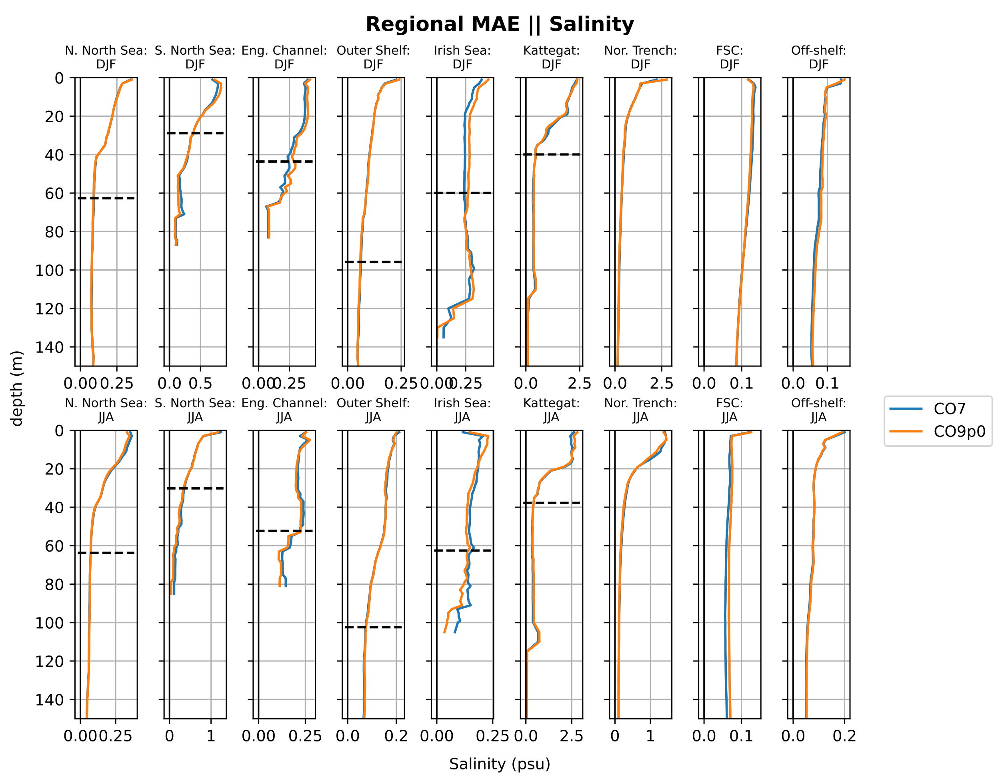
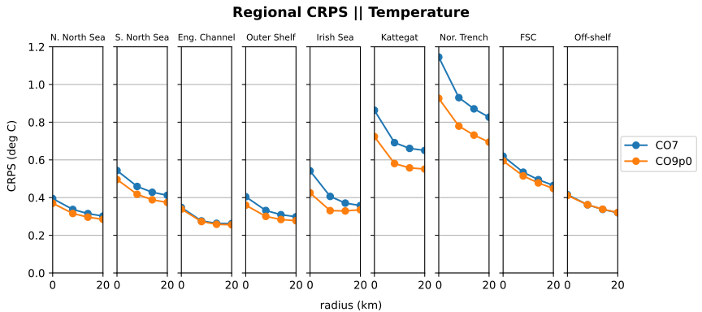
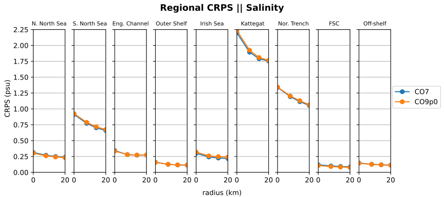
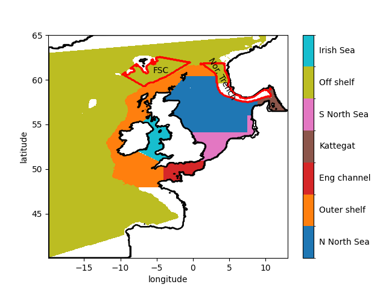

[](https://zenodo.org/badge/latestdoi/370984643)


# NEMO_validation
Scripts for validation of Coastal Ocean NEMO output.

## RDP temporary notes (2024/02/02)
Scripts have been restructed to avoid multiple config files and enable calling
across directories. Steps for install.

1. Set-up conda environemt
```
conda env create -n  nemo_validation -f environment.yml
``` 

2. Activate environment
```
conda activate nemo_validation
```

3. Insall NEMO_validation (ensuring location is package root)
```
pip install -e .
```

Developers can now import code from neighbouring directories. To add directories
to recognised list, add path to setup.py.

## Description

There are currently two components to these analyses given here:
* Assessment against a global dataset (EN4) of temperature and salinity profiles.
The workflow computes in "profile space" - extracting synthetic profiles from the simulation to match the observations 
and then computing statistics and metrics between the observed and simulated profile datasets.

* Assessment against a dataset of tidegauge sealevel timeseries:
The workflow computes in "tideguage space" - extracting synthetic tidegauge timeseries from the simulation to match the
observations and then computing statistics and metrics between the observed and simulated timeseries datasets.


The scripts are split into a number of sections with corresponding directories:
```
EN4_preprocessing
EN4_processing
EN4_postprocessing
```
and
```
Tidegauge_processing
```


# Steps for processing EN4 and model data 

## 1.Preprocess the EN4 data

Prior to computing diagnostics, the EN4 data is preprocessed into monthly COAsT-ready files for a restricted geographic domain.
To make it easier to work across sites and architectures two config files are used to control python and bash processes.

1. `cd EN4_preprocessing`

2. `config.sh` and `<MACHINE>_config.sh` must both be edited for machine choices, conda environment, paths etc.

Then preprocesing is triggered with:

3. Execute `. ./iter_en4_proc.sh`

which calls a machine dependant scheduler script `$MACHINE_pre_process_en4_monthly.sh` to invoke `pre_process_en4_monthly.py`

Output files are stored in the directory `config.sh: DOUT_EN4` with file structure: `<region>_processed_yyyymm.nc`. E.g.
`AMM15_processed_201410.nc`

## 2.Process monthly data to generate model error profiles with respect to EN4 profiles

1. `cd EN4_processing`

2. `PythonEnvCfg/<MACHINE>_config.sh` must both be edited for machine choices, conda environment, paths etc.

We use `iter_map_profiles.sh`  to submit over all years and months separately. This allows for simple parallelisation 
as each month can be independently processed. This script sets the paths and variable names and launches a machine specific
script to process each month.

```
sbatch ${MACHINE,,}_map_profiles.sh $start $month 
```

where:

* $start is the start year
* $month is the month

`lotus_map_profiles.sh` in turn calls the machine independent python script:

```
python  map_profiles.py $1 $2 > LOGS/OUT_$1_$2.log
```
using arguments: $1 $2 corresponding to the above.

This outputs, in `DN_OUT/profiles/`, files like: 
```
extracted_profiles_200401.nc
interpolated_profiles_200401.nc
interpolated_obs_200401.nc
profile_errors_200401.nc
surface_data_200401.nc
mid_data_200401.nc
bottom_data_200401.nc
mask_means_daily_200401.nc

```

However, some months have many profiles and some months few, so they take differing times to complete on different nodes.
Experience found that most months were completed in 20mins, about 10% needed 1hr, 5% 2hr and a couple needed 3hrs.
A short script with commandline control of the allocated walltime can see the slowest jobs, which previously ran out of 
walltime, through. For example:
```
#!/bin/bash
echo "Bash version ${BASH_VERSION}..."
cd ../PythonEnvCfg/
source config.sh
cd ../EN4_processing

rm LOGS/OUT* LOGS/*.err LOGS/*.out

#sbatch -J 201407 --time=2:00:00 lotus_ana_MOD_METEST.sh 2014 7 
#sbatch -J 201010 --time=2:00:00 lotus_ana_MOD_METEST.sh 2010 10 
#sbatch -J 201011 --time=2:00:00 lotus_ana_MOD_METEST.sh 2010 11 
sbatch -J 201109 --time=3:00:00 lotus_ana_MOD_METEST.sh 2011 9
#sbatch -J 201110 --time=2:00:00 lotus_ana_MOD_METEST.sh 2011 10 
sbatch -J 200905 --time=3:00:00 lotus_ana_MOD_METEST.sh 2009 5
```

2. `PythonEnvCfg/<MACHINE>_config.sh` must both be edited for machine choices, conda environment, paths etc.

### Concatenate error profiles (merge seasons)

Merge seasons (DJF, MAM, JJA, SON) from multiple years into single files.

Execute with:
```
iter_merge_season.sh
```
which is just a simple concatenating loop over each season.

Each month invokes a machine specific sbatch scripts (e.g `spice_merge_season.sbatch`) where the model and season are 
passed onto a generic script
`python merge_season.py $1 $2 #1=Model, 2=month` 

Outputs are written to DN_OUT by season string, sss:
```
sss_PRO_INDEX.nc  ## merging interpolated_profiles_*.nc (model profiles on ref levels)
sss_PRO_DIFF.nc   ## merging profile_errors_*.nc (diff between model & obs on ref levels)
```

### Create Means

Then call `iter_mean_season.sh` to compute the spatial means over subregions within the NWS domain.

This launches machine specific script 

`sbatch ${MACHINE,,}_mean_season.sbatch $MOD $month`
that in turn launches a machine independent script:
```
python mean_season.py $1 $2 > LOGS/mean_season_$1_$2.log  # 1=Model, 2=month
```

to compute averages in each of the defined regions:
```
region_names = [ 'N. North Sea','S. North Sea','Eng. Channel','Outer Shelf', 'Irish Sea', 
                    'Kattegat', 'Nor. Trench', 'FSC', 'Off-shelf']
```
Creating output:
```
DJF_mask_means_daily.nc
MAM_mask_means_daily.nc
JJA_mask_means_daily.nc
SON_mask_means_daily.nc
```

### CRPS values
There is a separate processing step to generate the surface CRPS values as a function of distance from the
observation locations. The CRPS algorithm loops over each observation, find the model indices with prescribed radii, and 
then calculates the CRPS. This is poorly optimised so is computed as a separate (optional) process. Each month is 
calculated individually, then merged and averaged over regions.

Execute: `. ./iter_surface_crps.sh`
This deploy monthly processes on ${MACHINE} (currently only tested on JASMIN's lotus)

```
sbatch "${MACHINE,,}"_surface_crps.sh $MOD $start $month $end $GRID"
```
which in turn launches the python script

```
python  surface_crps.py $1 $2 $3 $4 $5
```

following the appropriate header commands for the batch scheduler.
Output files take the form: `surface_crps_data_p0_201101_2012.nc`

Next merge and compute regional averages. E.g. merge_mean_surface_crps.py in EN4_postprocessing.

## 3.Postprocessing

1. `cd EN4_postprocessing`


### Plot the results.

Plot panels of regionally averaged profiles for summer and winter.

```
iter_plot_season.sh
```

sets machine specific paths and variables and launches

```sbatch ${MACHINE,,}_plot_season.sbatch```

which submits the following machine independent script

```python plot_season.py > LOGS/plot_season.log```

This plots multiple panels of area meaned profiles. One panel per region. Top row DJF and lower row JJA.
This also iterates over variables (temperature, salinity) and diagnostics (MAE, Bias).
E.g.


Outputs e.g. `FIGS/regional_means_abs_diff_salinity_test.svg`


### CRPS values

If CRPS outputs are calculated these can be postprocessed in this folder.

```
. ./iter_merge_mean_surface_crps.sh
```

sets machine specific paths and variables and launches

```
sbatch ${MACHINE,,}_merge_mean_surface_crps.sbatch $MOD
```

which submits the following machine independent script
```
python merge_mean_surface_crps.py $1 > LOGS/merge_mean_surface_crps_$1.log
```

Finally the plots can be made with 
```
python plot_surface_crps.py
```
For example (Byrne et al. 2023):



### Regional map

There is a simple script to plot the regions used for the decomposition, which uses the COAsT example
files:

```
python plot_regions.py
```


# Steps for processing Tidegauge and model data 

All of the tidegauge analysis is done in one directory.

`cd Tidegauge_processing`

This directory contains scripts which perform validation against hourly ssh data.

Overview:
There are 3 elements, extract (SSH from model at obs locations); analyse (concurrent ssh and threshold analysis 
on model and obs data); plot. For short timeseries these can and where done as a single (slow) job. However with 10 
years of data it makes sense to slice the stages to spread them across parallel tasks.
The extract stage can be sliced across monthly jobs
The analysis stage can be sliced across the port dimension.
This slices makes the entire process fast on JASMIN, though a little harder to follow.


Workflow:

Set machine in `config.sh`
Ensure paths are correctly set in `<machine>_config.sh`

Execute with

```
. ./iter_tg_preprocess.sh
```

This reads `<machine>_config.sh` to set paths
Then queues monthly jobs using `<machine>_pre_process_tg_monthly.sh`
 Which runs the machine independent script: `pre_process_tg_monthly.py` with methods in `validate_ssh_tg_hourly.py`
 which creates monthly files of extracted NEMO data at gauge locations

Execute:
`. ./iter_tg_analysis.sh`

This queues `N_PORTS` jobs `<machine>_process_tg_monthly.sh`
which extracts the port of interest from all the monthly data.
Harmonic and threshold analyses are applied and save in one file per port.


Then in the terminal that executed the above:

```
python postprocess_tg_monthly.py
python plot_tg.py
```

Concat all the port data into a single file
then plots outputs into figure directory: `DN_OUT`


Might need to make some directories if they are not there. E.g.:
```
mkdir /gws/nopw/j04/jmmp/CO9_AMM15_validation/P1.5c/
mkdir /gws/nopw/j04/jmmp/CO9_AMM15_validation/P1.5c/tg_analysis/
mkdir /gws/nopw/j04/jmmp/CO9_AMM15_validation/P1.5c/tg_analysis/FIGS/
```

### Other files

`analyse_ssh_hourly.py`
        A partial clone and maybe parent of validate_ssh_tg_hourly.py
        Should be removed when it is thoroughly borrowed from

`harmonic_variation.py`
        WIP: computing error estimates on harmonic amplitudes generated from observational data of unknown nodal phase.


